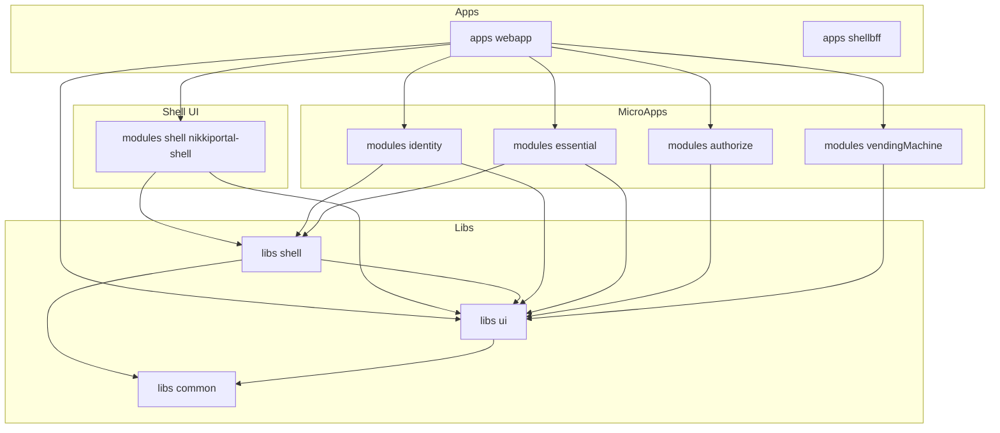
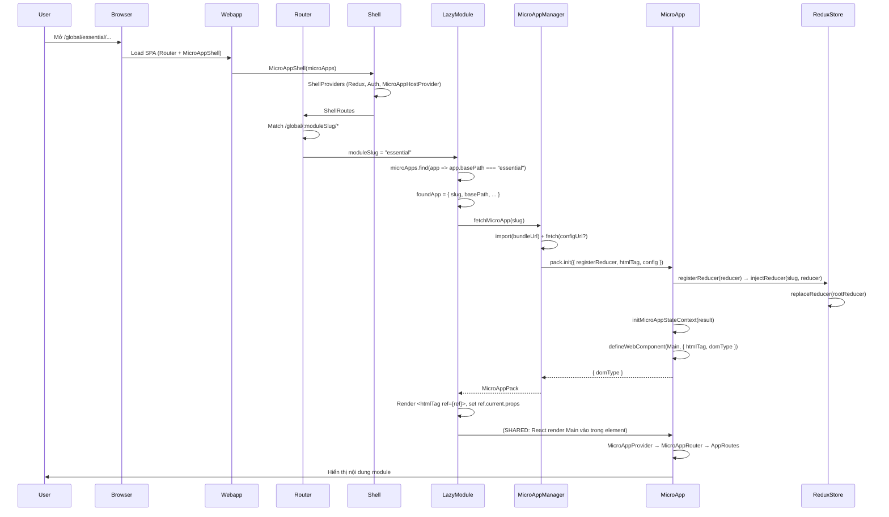
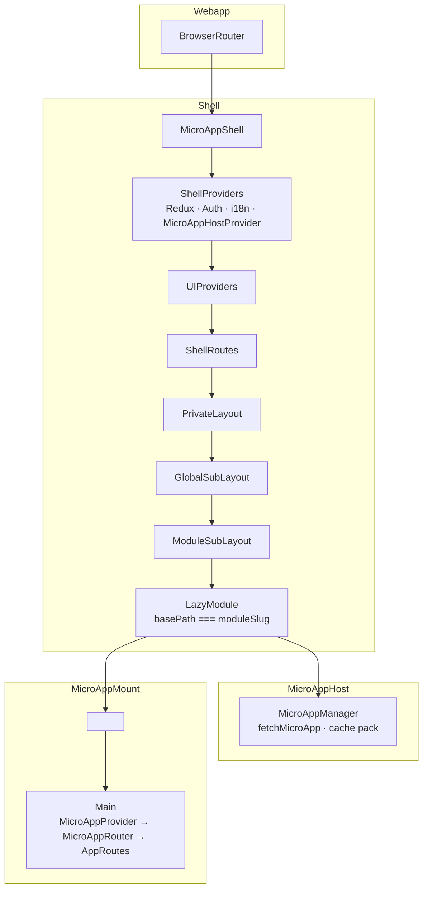

# Kiến trúc Project — Nikki ERP Frontend (Micro-Frontend)

Tài liệu mô tả kiến trúc monorepo và luồng runtime của Shell + Micro-App.

---

## 1. Cấu trúc Monorepo (pnpm workspace)

```
nikki-erp-frontend-react/
├── apps/
│   ├── webapp/              # Host SPA: Router + MicroAppShell + danh sách microApps
│   └── shellbff/            # BFF server (config, proxy, ...)
├── libs/
│   ├── ui/                   # @nikkierp/ui — UI chung + contract microApp (types, Provider, Router, WebComponent)
│   ├── shell/                # @nikkierp/shell — logic Shell: MicroAppManager, ShellProviders, store, auth
│   └── common/               # @nikkierp/common — request, utils
├── modules/
│   ├── shell/                # @nikkierp/nikkiportal-shell — Shell UI: layouts, routes, LazyModule, pages
│   ├── identity/             # @nikkierp/microapp-identity
│   ├── essential/            # @nikkierp/microapp-essential
│   ├── authorize/            # @nikkierp/microapp-authorize
│   └── vendingMachine/       # @nikkierp/microapp-vendingMachine
└── packages/                 # shared config (typescript, eslint, ...)
```

Sơ đồ phụ thuộc giữa các package:



---

## 2. Luồng Runtime — Từ URL đến Micro-App



---

## 3. Kiến trúc Component Tree (Runtime)



---

## 4. State Management (Redux)

```mermaid
flowchart LR
    subgraph Redux Store (một store duy nhất)
        auth[auth]
        layout[layout]
        routing[routing]
        shellConfig[shellConfig]
        userContext[userContext]
        lazy["lazyReducers\n(slug → reducer)"]
    end

    subgraph Shell
        store[store.ts]
        inject[injectReducer]
        factory[registerReducerFactory]
    end

    subgraph MicroApp init
        pack_init[pack.init]
        register[registerReducer]
    end

    store --> auth
    store --> layout
    store --> routing
    store --> shellConfig
    store --> userContext
    store --> lazy

    pack_init --> register
    register --> factory
    factory --> inject
    inject --> lazy
```

- **Shell** tạo một Redux store với reducer cố định (auth, layout, routing, ...).
- Khi micro-app gọi `pack.init({ registerReducer })`, nó gọi `registerReducer(itsReducer)`.
- **registerReducerFactory(slug)** inject reducer vào `lazyReducers[slug]` và gọi `store.replaceReducer()`.
- Micro-app dùng `useMicroAppSelector` / `useRootSelector` / `useMicroAppDispatch` từ context (value = `{ dispatch, selectMicroAppState, selectRootState }`).

---

## 5. Luồng tải Micro-App (MicroAppManager)

```mermaid
flowchart TD
    A[fetchMicroApp(slug)] --> B{Đã có trong\ndownloadedPacks?}
    B -->|Có, đã resolve| C[Return pack]
    B -->|Chưa / đang fetch| D[dependsOn?]
    D --> E[Promise.all: fetch dependency slugs]
    E --> F[fetchPack: importBundle + fetchConfig]
    F --> G[import(bundleUrl) hoặc bundleUrl()]
    F --> H[fetch(configUrl) nếu có]
    G --> I[pack.init(registerReducer, ...)]
    I --> J[Lưu pack vào downloadedPacks]
    J --> C
```

---

## 6. Hai chế độ mount (DOM)

```mermaid
flowchart TB
    subgraph SHARED["SHARED (Light DOM)"]
        S1["<microapp-xxx>"]
        S2[Shell render Main vào children]
        S3[Main dùng chung DOM với Shell]
        S1 --> S2
        S2 --> S3
    end

    subgraph ISOLATED["ISOLATED (Shadow DOM)"]
        I1["<microapp-xxx>"]
        I2[attachShadow]
        I3["#root"]
        I4[Web component set props → _render()]
        I5[ReactDOM.createRoot(#root).render(Main)]
        I1 --> I2
        I2 --> I3
        I3 --> I4
        I4 --> I5
    end
```

---

## 7. Routing Shell vs Micro-App

```mermaid
flowchart LR
    subgraph Shell Routes
        R1["/signin"]
        R2["/global"]
        R3["/global/:moduleSlug/*"]
        R4["/:orgSlug"]
        R5["/:orgSlug/:moduleSlug/*"]
    end

    R3 --> LazyModule
    R5 --> LazyModule

    subgraph Micro-App Routes (bên trong LazyModule)
        M1[basePath từ metadata]
        M2[AppRoutes + AppRoute]
        M3[WidgetRoutes + WidgetRoute]
    end

    LazyModule --> M1
    M1 --> M2
    M1 --> M3
```

- Shell route `:moduleSlug` map tới **một** micro-app qua `microApps.find(app => app.basePath === moduleSlug)`.
- Micro-app nhận `routing.basePath`, `routing.location`, `routing.navigator` (nếu Shell trong Router) và tự render `<AppRoutes>` / `<BrowserRouter>` / `<Router>` tùy domType và có hay không có location từ Shell.

---

## 8. Tóm tắt

| Tầng | Package / Thư mục | Vai trò |
|------|-------------------|---------|
| Host | `apps/webapp` | SPA entry: Router, render MicroAppShell, truyền danh sách microApps |
| Shell UI | `modules/shell` (@nikkierp/nikkiportal-shell) | Layouts, ShellRoutes, LazyModule, trang Shell (signin, notfound, ...) |
| Shell Core | `libs/shell` (@nikkierp/shell) | MicroAppManager, MicroAppHostProvider, store + injectReducer, auth, ShellProviders |
| Shared UI + Contract | `libs/ui` (@nikkierp/ui) | Types microApp, MicroAppProvider, MicroAppStateProvider, MicroAppRouter, defineWebComponent |
| Micro-Apps | `modules/identity`, `essential`, `authorize`, `vendingMachine` | Bundle export default MicroAppBundle, init + defineWebComponent + registerReducer, Main (MicroAppProvider → MicroAppRouter) |
| Common | `libs/common` | Request, utils dùng chung |

File này có thể mở bằng công cụ hỗ trợ Mermaid (VS Code extension, GitHub, GitLab, Notion, …) để xem sơ đồ.
